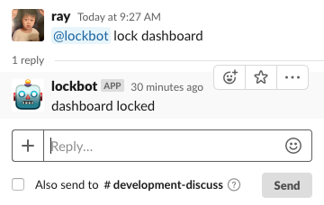

# Slack Lock Bot

A Slack bot for helping you lock and unlock things.

## Development

- [Create a development Slack bot](http://slack.com/services/new/bot)
- Run `bin/setup`
- Set `SLACK_API_TOKEN` inside of `.env`
- Run `foreman start`
- Invite your bot to a channel

## Testing

- Run `rspec`

## Deploy to Heroku

- [Create a production Slack bot](http://slack.com/services/new/bot)
- Create an app on Heroku
- Set `SLACK_API_TOKEN` on Heroku
- Add your heroku remote `git remote add heroku https://git.heroku.com/your-slack-bot-app.git`
- Run `bin/deploy`
- Invite your bot to a channel
